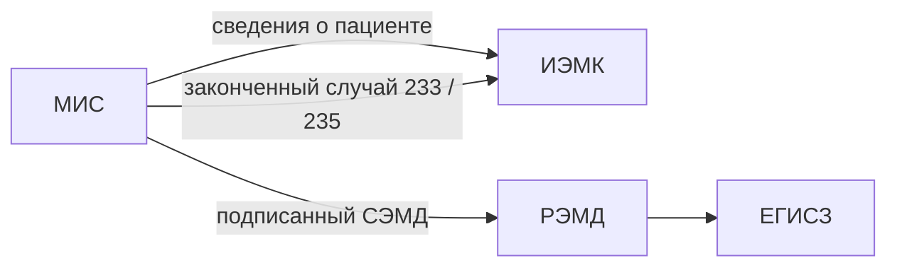

# Архитектура обмена

Схема обмена данными между МИС, ИЭМК, РЭМД и ЕГИСЗ.

## Назначение

МИС передаёт данные в ЕГИСЗ по трём независимым потокам: сведения о пациенте и законченные случаи — в ИЭМК, подписанный СЭМД — в РЭМД с последующей регистрацией в ЕГИСЗ.

## Значения / параметры

<!-- TODO: источник не найден -->

## Ограничения

<!-- TODO: источник не найден -->

## Связанные материалы

- [РЭМД и ИЭМК](./remd-iemk.mdx)
- [Процесс подключения](./connection-process.mdx)
