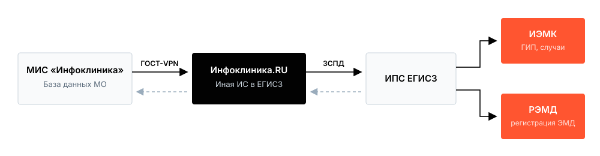

# Интеграция с ЕГИСЗ

*Редакция от 1 августа 2026 г. Смарт Дельта Системс.*

[Настройки](%D0%9D%D0%B0%D1%81%D1%82%D1%80%D0%BE%D0%B9%D0%BA%D0%B8%203b124900f5dc801aac6ae2e304570a47.md)

[Тестирование](%D0%A2%D0%B5%D1%81%D1%82%D0%B8%D1%80%D0%BE%D0%B2%D0%B0%D0%BD%D0%B8%D0%B5%203b124900f5dc80409749e97d1742a55c.md)

[Эксплуатация](%D0%AD%D0%BA%D1%81%D0%BF%D0%BB%D1%83%D0%B0%D1%82%D0%B0%D1%86%D0%B8%D1%8F%203b124900f5dc803bbfc9c3fc9abe3754.md)

Документ описывает подключение медицинской организации к подсистемам ЕГИСЗ — интегрированной электронной медицинской карте (ИЭМК) и реестру электронных медицинских документов (РЭМД) — средствами МИС «Инфоклиника» и портала «[Инфоклиника.RU](http://Инфоклиника.RU)».

Работы распределены между медицинской организацией и специалистами СДС. Зона ответственности участников интеграции указана в соответствующем разделе.

Подключение конкретных видов СЭМД приобретается отдельно от тарифной опции интеграции.

---

# Архитектура информационного обмена

Медицинская организация передаёт данные в ЕГИСЗ через портал «[Инфоклиника.RU](http://Инфоклиника.RU)» — иную информационную систему, зарегистрированную в ЕГИСЗ и подключённую к промышленной среде сервисов ИЭМК и РЭМД.

Последовательность обмена:

1. МИС формирует сообщение xml с подписью. Сообщение состоит из двух частей: заголовок и тело документа ~~после подписания протокола~~.
2. Служба репликации отправляет сообщение с документом через портал «[Инфоклиника.RU](http://Инфоклиника.RU)».
3. В асинхронном режиме происходит запрос документа из МИС и его валидация.
4. Ответ подсистемы ЕГИСЗ поступает на портал и передаётся в МИС.

| **Параметр** | **ИЭМК** | **РЭМД** |
| --- | --- | --- |
| Объект передачи | Сведения о пациенте | Электронный медицинский документ |
| Событие формирования | Изменение данных пациента | Подписание протокола УКЭП |
| Электронная подпись | Не требуется | УКЭП врача |
| Настройка адреса ответов | Адрес callback получения ответов от ИПС, порт 9921 | Адрес callback получения запросов на документ от РЭМД, порт 9945 |
| Заявка в ЕГИСЗ | Заявка на подключение к ИЭМК | Заявка на подключение к РЭМД |

# Порядок подключения

## Организационный этап

Организационным этапом занимается коммерческий отдел.

| **Шаг** | **Действие** | **Исполнитель** |
| --- | --- | --- |
| 1 | Заключение договора на портал «[Инфоклиника.RU](http://Инфоклиника.RU)» с тарифной опцией интеграции с ЕГИСЗ | МО, СДС |
| 2 | Регистрация юридического лица и структурных подразделений в ФРМО, внесение сведений о медицинских работниках в ФРМР | МО |
| 3 | Заполнение заявок на подключение к сервисам ИЭМК и РЭМД по формам Минздрава России. Отдельная заявка оформляется на каждое юридическое лицо | МО |
| 4 | Подписание заявок, проставление печати, передача сканов и файлов в формате Word в СДС | МО |
| 5 | Направление заявок медицинской организации и оператора информационной системы в службу технической поддержки ЕГИСЗ | СДС |
| 6 | Получение подтверждения подключения от службы технической поддержки ЕГИСЗ | СДС - комм отдел |
| 7 | Определение перечня видов СЭМД для передачи в РЭМД и соответствия им типов протоколов ИБ, применяемых в медицинской организации | МО |

## Технические требования

- МИС «Инфоклиника» текущей поддерживаемой версии с установленными актуальными обновлениями.
- Модули МИС: «Электронная история болезни пациента», «Базовая электронная подпись».
- Подключение к порталу «[Инфоклиника.RU](http://Инфоклиника.RU)» и установленное средство криптографии и туннелирования OpenVPN ГОСТ. Лицензия для VPN предоставляется при подключении к порталу.
- Соответствие сервера МИС и сетевой инфраструктуры техническим требованиям, приведённым в приложении № 5 договора на предоставление услуг в рамках портала «[Инфоклиника.RU](http://Инфоклиника.RU)».
- Настроенные криптографические библиотеки для доверенной авторизации между базами данных.
- Действующая УКЭП у каждого врача, подписывающего электронные медицинские документы.
- СКЗИ КриптоПро CSP 4.х или 5.х, доступное в сессии пользователя.
    - Удалённый доступ специалистов СДС к серверу МИС и к серверу с OpenVPN ГОСТ на период настройки.

## Несколько юридических лиц в одной базе данных

Интеграция каждого юридического лица настраивается независимо:

- собственный OID юридического лица из ФРМО;
- собственные финподразделения с OID и федеральными наименованиями из ФРМО;
- регистрация врачей в ФРМР по месту работы в соответствующем юридическом лице;
- отдельные заявки на подключение к ИЭМК и к РЭМД.

Настройки юридических лиц и финподразделений в МИС определяют организацию, от лица которой формируется и передаётся документ. Документ формируется от организации, в которой врач провёл приём.

# Электронная подпись

## Подпись медицинского работника

Электронный медицинский документ подписывается УКЭП медицинского работника, сформировавшего документ (приказ № 947н, пункт 9). Персональная ответственность медицинского работника установлена 323-ФЗ.

Требования к сертификату:

- сертификат УКЭП физического лица;
- состав сведений: ФИО, СНИЛС, ИНН владельца.

Полномочия сотрудника и его связь с медицинской организацией подтверждаются при регистрации документа: РЭМД находит СНИЛС из подписи в ФРМР и сверяет место работы и должность со сведениями запроса.

Лицензирование СКЗИ и варианты поставки УКЭП необходимо уточнять у поставщика удостоверяющего центра.

> ОГРН медицинской организации в сертификате врача не указывается. Подписание документов врачей сертификатом руководителя, председателя врачебной комиссии или иного лица не допускается.
> 
- Долгосрочное хранение подписанных документов
    
    Услуга предоставляется компанией отдельно и в состав работ по подключению и обслуживанию интеграции не входит.
    
    Базовая УКЭП формата CAdES-BES проверяется в пределах срока действия сертификата, типовой срок — 12–15 месяцев.
    
    Регистрация СЭМД в РЭМД фиксирует действительность сертификата на момент подписания. Документ хранится в медицинской организации в течение нормативного срока, для отдельных видов документации — до 75 лет.
    
    Для проверки подписи в течение всего срока хранения экземпляра в медицинской организации применяются форматы CAdES-X Long и CAdES-A с меткой доверенного времени TSP и сведениями о статусе сертификата OCSP. Основание — 63-ФЗ, статья 11.
    

---

# Нормативные основания

| **Документ** | **Предмет регулирования** |
| --- | --- |
| Федеральный закон от 21.11.2011 № 323-ФЗ, ст. 91 и 91.1 | Состав сведений, размещаемых медицинскими организациями в ЕГИСЗ. Персональная ответственность медицинских работников |
| Постановление Правительства РФ от 09.02.2022 № 140, ред. от 26.12.2025 | Положение о ЕГИСЗ. Состав подсистем, порядок и сроки размещения сведений. Сведения размещаются в течение одного рабочего дня со дня формирования медицинского документа |
| Постановление Правительства РФ от 01.06.2021 № 852 | Положение о лицензировании медицинской деятельности. Размещение сведений в ЕГИСЗ включено в состав лицензионных требований |
| Приказ Минздрава России от 07.09.2020 № 947н | Порядок ведения медицинской документации в форме электронных документов. Пункт 9: документ подписывается УКЭП медицинского работника, сформировавшего документ |
| Федеральный закон от 06.04.2011 № 63-ФЗ, ст. 11 | Условия признания квалифицированной электронной подписи |

# Термины и сокращения

| **Сокращение** | **Значение** |
| --- | --- |
| **ЕГИСЗ** | Единая государственная информационная система в сфере здравоохранения |
| **ИЭМК** | Федеральная интегрированная электронная медицинская карта. Подсистема ЕГИСЗ, накапливающая сведения о случаях оказания медицинской помощи |
| **ГИП** | Главный индекс пациентов. Компонент ИЭМК, содержащий демографические сведения о пациенте и его идентификаторы в информационных системах |
| **РЭМД** | Реестр электронных медицинских документов. Подсистема ЕГИСЗ, выполняющая регистрацию и учёт электронных медицинских документов, подписанных УКЭП |
| **ЭМД** | Электронный медицинский документ |
| **СЭМД** | Структурированный электронный медицинский документ в формате HL7 CDA R2 |
| **УКЭП** | Усиленная квалифицированная электронная подпись |
| **ФРМО** | Федеральный реестр медицинских организаций |
| **ФРМР** | Федеральный регистр медицинских работников |
| **ФНСИ, НСИ** | Федеральная система нормативно-справочной информации Минздрава России |
| **ФСЛИ** | Федеральный справочник лабораторных исследований |
| **ИПС ЕГИСЗ** | Подсистема интеграции прикладных систем ЕГИСЗ |
| **ЗСПД** | Защищённая сеть передачи данных |
| **OID** | Object Identifier. Идентификатор, присваиваемый юридическому лицу и структурным подразделениям при регистрации в ФРМО |
| **ЕГРЮЛ** | Единый государственный реестр юридических лиц |
| **ЕСИА** | Единая система идентификации и аутентификации |
| **ФИАС** | Федеральная информационная адресная система |
| **СКЗИ** | Средство криптографической защиты информации |
| **ЭЦП** | Наименование электронной подписи в интерфейсе МИС |
| **Протокол ИБ** | Протокол истории болезни. Запись электронной медицинской карты пациента в МИС |
| **МО** | Медицинская организация |
| **МИС** | Медицинская информационная система «Инфоклиника» |
| **СДС** | ООО «Смарт Дельта Системс», разработчик МИС «Инфоклиника» |

*Документ подготовлен ООО «Смарт Дельта Системс». Вопросы по составу работ и настройке направляются в службу технической поддержки.*